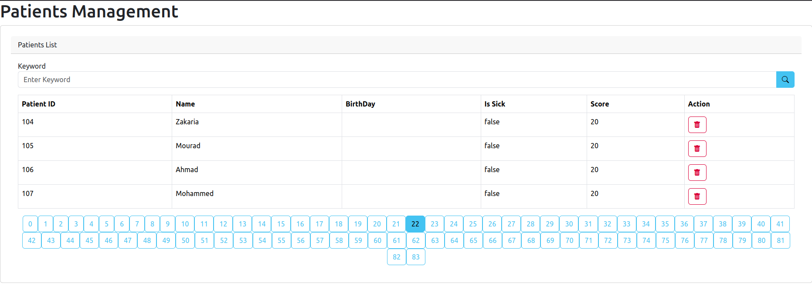

# **BestPractices-WebApp-SpringMVC-Thymeleaf**  
  

## **Introduction**  
This repository is part of the **Best Practices Web Application** series, demonstrating how to build a **Spring Boot web application** using **Spring MVC**, **Thymeleaf**, and **Spring Data JPA**. It focuses on **managing patients** with a clean and maintainable architecture.  

## **Features**  
✔️ **Complete CRUD Operations**:
  - **Create** – Add new patient records with validation
  - **Read** – Display patients in a structured view
  - **Update** – Edit existing patient information
  - **Delete** – Remove patient records

✔️ **Pagination** – Efficiently navigate through patient records  
✔️ **Search Functionality** – Find patients dynamically  
✔️ **State Preservation** – Maintains view state after operations (create/update)  
✔️ **Enhanced UI/UX** – Improved user experience with icons and interactive elements  

## **Technologies Used**  
🔹 **Java 17+**  
🔹 **Spring Boot** (Spring MVC, Spring Data JPA)  
🔹 **Thymeleaf** (for frontend rendering)  
🔹 **MySQL Database** (for presisting data)  
🔹 **Bootstrap** (for styling and responsiveness)  

## **Setup & Installation**  
1️⃣ Clone the repository:  
```sh  
git clone https://github.com/MOHAJII/BestPractices-WebApp-Part2-SpringMVC-Thymeleaf.git 
cd SpringMVC-Thymeleaf 
```  

2️⃣ Run the application using Maven:  
```sh  
mvn spring-boot:run  
```  

3️⃣ Open your browser and access:  
```
http://localhost:8085
```  

## **Key Implementation Details**
- **Full CRUD Implementation** - Complete patient management lifecycle
- **Form Validation** - Data integrity verification 
- **State Management** - Preserves user context after operations
- **Responsive Design** - Works across different screen sizes

## **Upcoming Features**
🔒 The next part in this BestPractices series will focus on **security enhancements**:
- Various **authentication methods** implementation
- **Authorization** and role-based access control
- **Secure endpoints** and data protection
- Best practices for **web application security**

## **Conclusion**  
This project demonstrates how to integrate **Spring MVC, Thymeleaf, and Spring Data JPA** to build a **modern, full-stack web application** with complete CRUD functionality. It follows best practices for web development.
